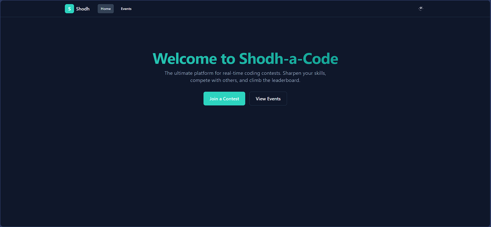

# Shodh-a-Code

A lightweight, real-time coding contest platform built with Spring Boot and React.

## Features

- **Real-time Judging**: Instant feedback on code submissions with support for multiple test cases.
- **Live Leaderboard**: See your rank update in real-time as you solve problems.
- **Multiple Languages**: Supports Java, C++, Python, and JavaScript.
- **Modern UI**: A clean and modern user interface with light and dark themes.

## Technologies Used

- **Backend**: Spring Boot, Maven
- **Frontend**: React, Vite, Tailwind CSS
- **Judge**: Docker

## Setup Instructions

### Using Docker Compose

The easiest way to run the entire application is by using the `docker-compose.yml` file located in the `backend` directory.

1.  Navigate to the `backend` directory:
    ```bash
    cd backend
    ```
2.  Run the following command:
    `bash
    docker-compose up --build
    `
    This will start the backend server on port `8080` and the frontend server on port `5173`.

### Local Setup

If you prefer to run the services locally without Docker Compose:

1.  **Backend**

    ```bash
    cd backend/demo
    ./mvnw spring-boot:run
    ```

2.  **Frontend**
    ```bash
    cd frontend
    npm install
    npm run dev
    ```
    The frontend will be available at `http://localhost:5173`.

## API Design

The backend provides the following REST API endpoints:

- `GET /api/contests`: Get a list of all contests.
- `GET /api/contests/{contestId}`: Get details for a specific contest, including its problems.
- `GET /api/contests/{contestId}/leaderboard`: Get the leaderboard for a specific contest.
- `POST /api/submissions`: Submit a solution to a problem.
- `GET /api/submissions/{submissionId}`: Get the status and results of a submission.
- `POST /api/run`: Run code against the first two test cases of a problem without submitting.

## Design Choices & Justification

- **Backend (Spring Boot)**: Chosen for its rapid development capabilities and robust ecosystem. The embedded Tomcat server simplifies deployment and testing.
- **Frontend (React + Vite)**: React is a popular and powerful library for building user interfaces. Vite provides a fast development experience with hot module replacement.
- **Styling (Tailwind CSS)**: A utility-first CSS framework that allows for rapid UI development without writing custom CSS.
- **Judge (Docker)**: Using Docker for the code judge provides a secure and isolated environment for executing user-submitted code, preventing any potential harm to the host system.
- **In-memory Database**: For this prototype, an in-memory data store is used for simplicity and to avoid the need for a database setup. For a production environment, this would be replaced with a persistent database like PostgreSQL.

## Screenshots

### Events Page


### Example for Testing


### Home



### Join Contest Page


### Problem and Code Editor


